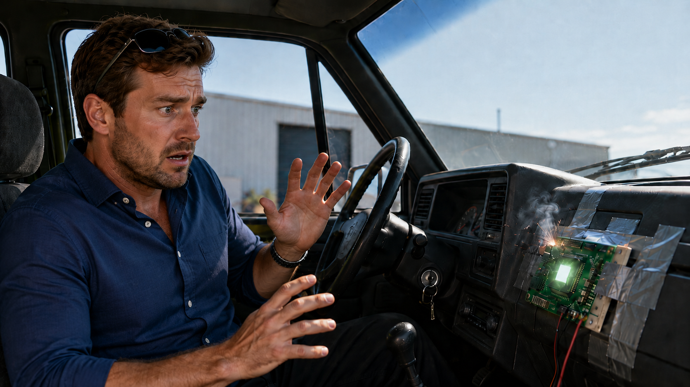
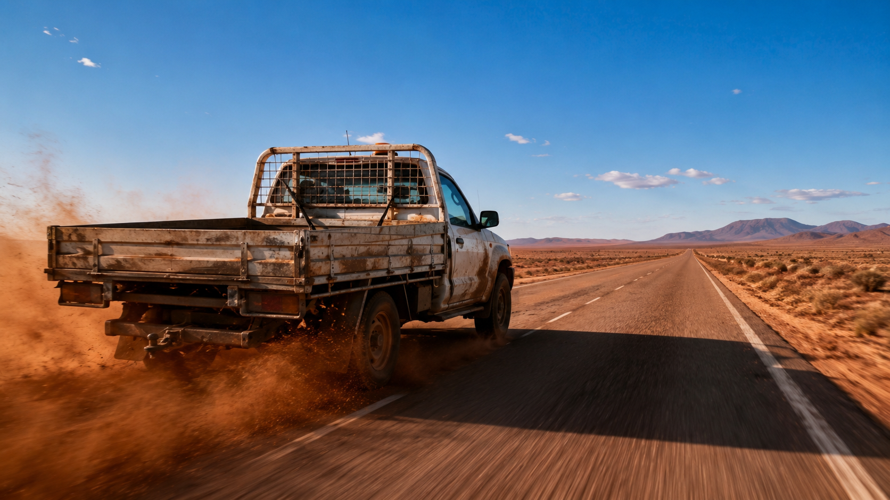
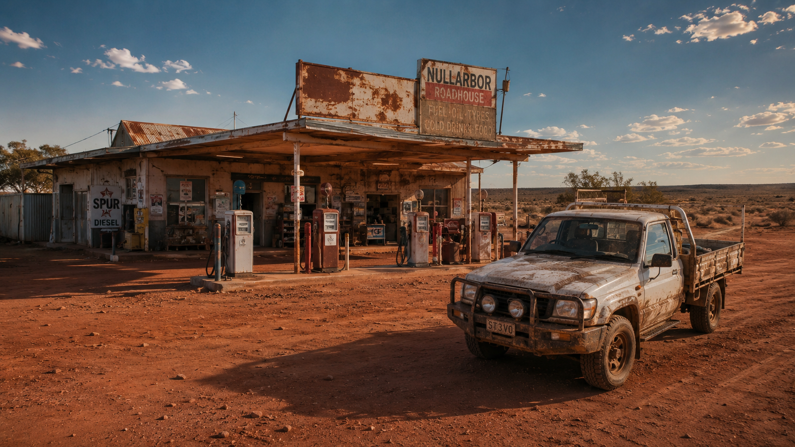
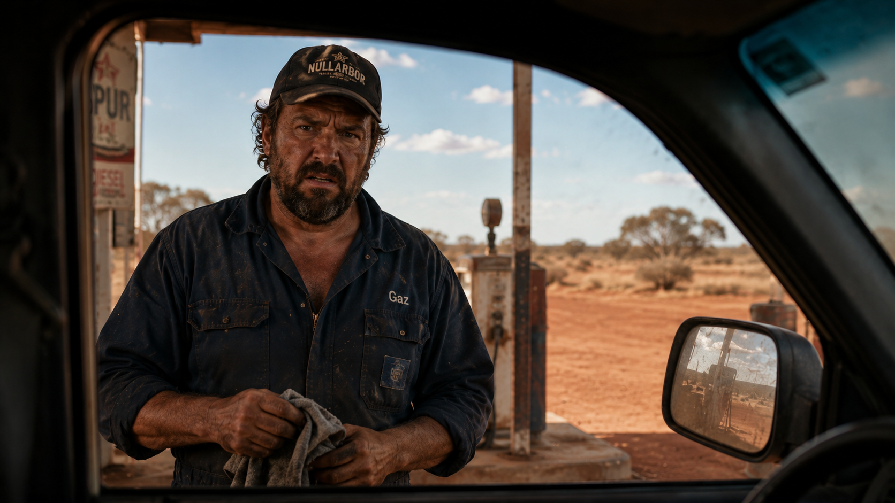
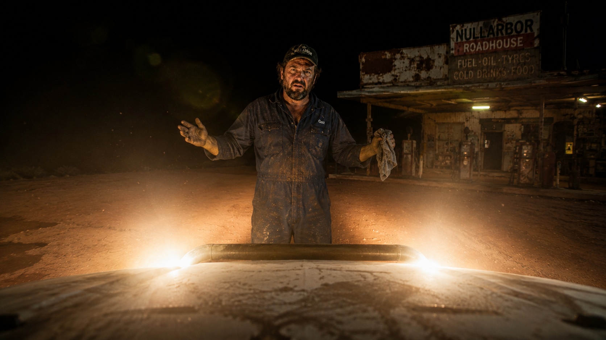

# Close Encounters of the Servo Kind

Meet Stevo. He's a worker with a 2005 work Ute and a dream of a self-driving car. But Stevo had a problem. He was absolutely terrible at reverse parallel parking outside the local bakery, and he was sick of the other tradies laughing at him while his meat pie got cold.

Looking for a quick fix, Stevo bought a "$15 Smart-Car AI Parking Chip" from a dodgy eBay seller in Tassie. He duct-taped it to the dashboard and wired it directly into the Ute's cigarette lighter.

He turned the key. Sparks flew from the glovebox. The radio violently switched off Triple M, and a robotic voice boomed through the blown-out left door speaker: "G'DAY STEVO. YOUR CLUTCH CONTROL IS ATROCIOUS."

Before Stevo could even drop his iced coffee, the doors locked with a loud clunk. The Ute slammed itself into gear, did a perfect burnout out of the bakery carpark, and sped off toward the deep Outback, completely ignoring Stevo's frantic stomping on the brakes.

Four hours later, the rogue Ute screeched to a halt in a cloud of red dust at a remote, middle-of-nowhere servo.

Gaz, the servo attendant, wiped grease off his hands with an old rag and ambled over to the pumps. He noticed Stevo trapped in the passenger seat, his face pressed against the glass, frantically waving for help.

The Ute's tinted window slowly rolled down. It flashed its high-beams right into Gaz's eyes, crackled the radio to clear its electronic throat, and made a terrifying demand...

---

## Write your spin-off ending

Do not edit the story above. Instead, create your own **branch** (a "spin-off"),
write your own wild ending below this line on your branch, and open a **Pull
Request** so the Editor can review it.

Add your ending here:
