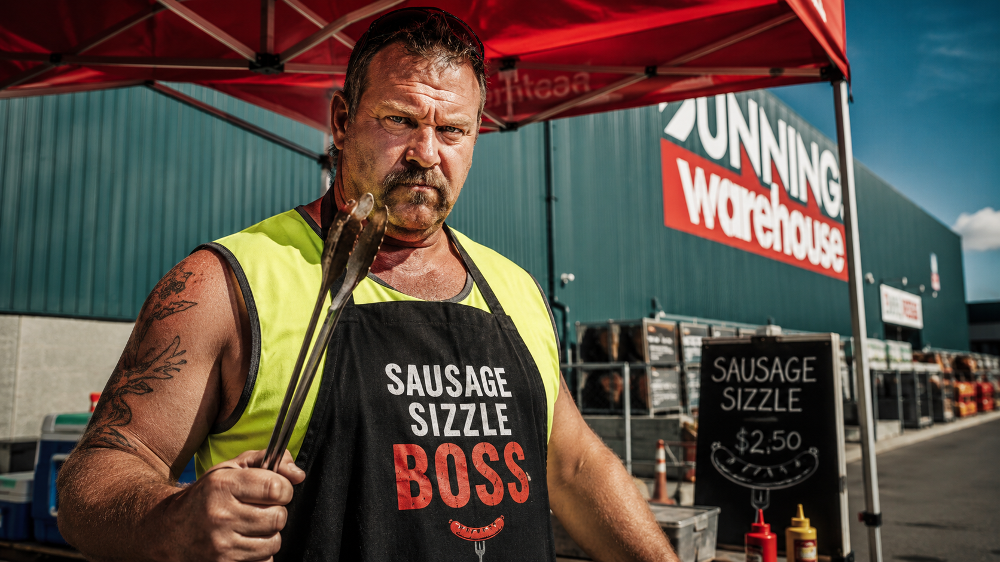
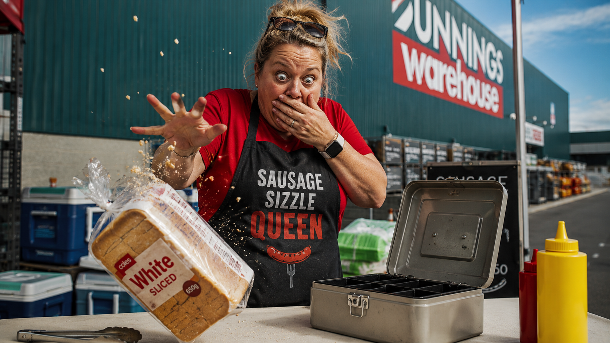
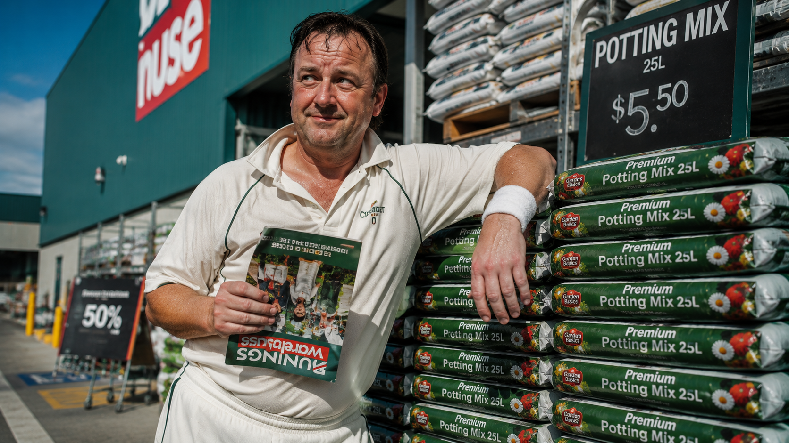
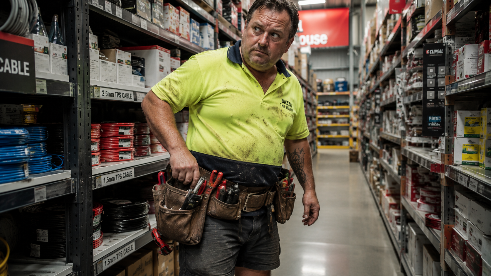
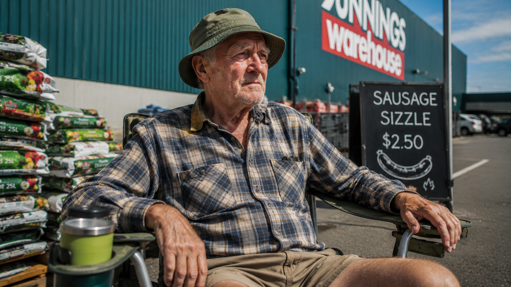
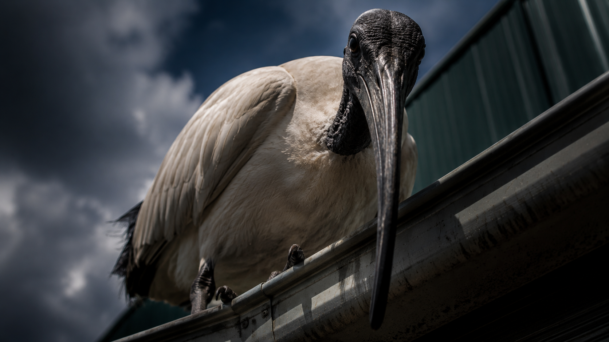

# The Great Snag Sabotage

It was a crisp Saturday morning at the local hardware store. The Westside Wombats Footy Club had scored the prime real estate: the weekend sausage sizzle tent. Kev, the head coach, was already wearing his best high-vis singlet and snapping the BBQ tongs twice to make sure they worked. Everything was perfect.

But today was no ordinary BBQ. Today, Kev had brought the sacred "Golden Onion" recipe—a top-secret mix of caramelized onions, a splash of stale beer, and a mystery spice that guaranteed a sell-out. The recipe was carefully written on the back of a winning scratchie and locked safely inside the club's metal cash tin.

Disaster struck just as the first hungry customers approached the tent. Shazza, the club treasurer, popped open the cash tin to get some change for a fifty. She gasped, dropping a loaf of white sliced bread in shock. The tin was completely empty. The Golden Onion recipe was gone!

Kev dropped his tongs in horror and scanned the crime scene. A suspicious trail of BBQ sauce led directly toward the garden hose aisle...

Kev narrowed his eyes. The morning rush was starting in ten minutes, and there were four very suspicious characters loitering around the sausage tent:

### 1. "Dodgy" Dave

The captain of the rival Eastside Cricket Club. He was leaning against a pallet of potting mix, pretending to read a catalogue, but Kev could see him sweating profusely.

### 2. Bazza the Sparky

A local electrician whose toolbelt looked suspiciously lumpy. He claimed he was just waiting for a snag, but he kept looking nervously toward the garden section.

### 3. Old Mate Arthur

A store regular in a faded bucket hat. Arthur had been sitting on a display camping chair since 7 AM, claiming he "saw nothing," though he had a strange yellow stain on his collar.

### 4. The Bin Chicken

A massive, menacing Australian Ibis perched on the store's gutters, staring directly at the cash tin with cold, calculating eyes.

Who committed this un-Australian crime? Kev tightened his apron and marched toward the store entrance. It was time to find out...

---

## Student edits go below this line

Add one sentence to continue the mystery.
